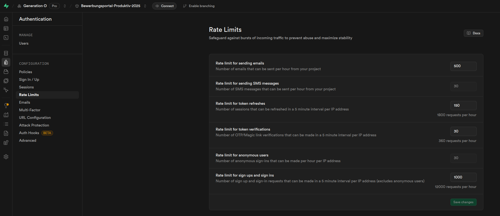
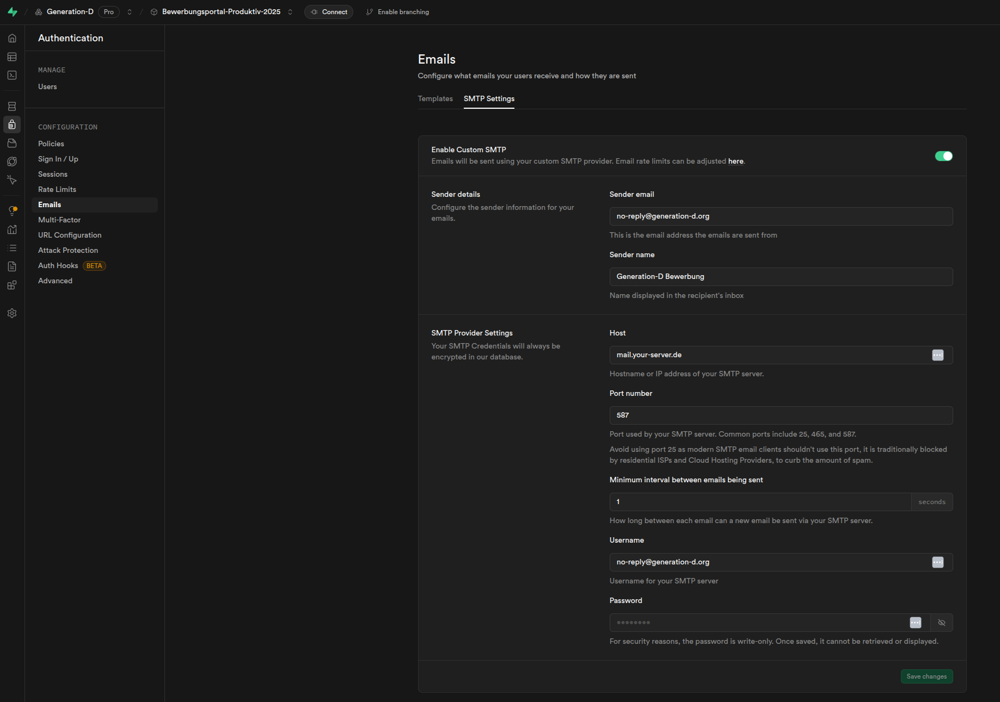
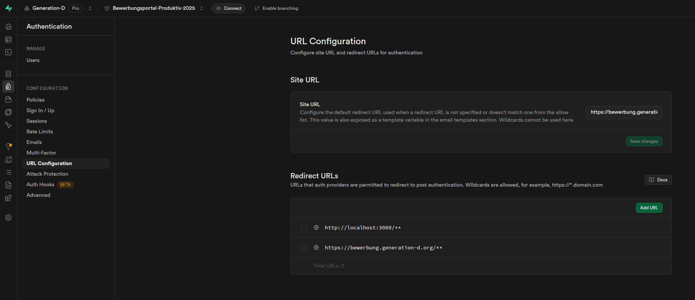

# Application Platform Testing

For testing we use a free Supabase instance. This is deleted after 90 days if not used.

## General Supabase Instance Setup

1. Go on supabase.com and create a new project.

2. Execute the sql scripts in `application-platform/backend/backend/sql` on the supabase instance (in the "SQL Editor" tab of Supabase).
    - application-platform/backend/backend/sql/init_db.sql
        - For deleting or emptying the database, use the sql script `application-platform/backend/backend/sql/delete_db.sql` and `application-platform/backend/backend/sql/empty_db.sql`.
    - application-platform/backend/backend/sql/bucket_policies.sql
    - application-platform/backend/backend/sql/functions.sql
    - application-platform/backend/backend/sql/pdf_bucket_policy_PERMISSIVE.sql (this makes sure the PDFs upload works)

3. Set the rate limits like:
    

4. Set the email templates using the templates in `application-platform/backend/backend/templates` for:
    - "Confirm signup"
    - "Reset Password"
    - "Change Email Address"

5. Email Settings - SMTP Settings tab - set as follows:
    

6. Set the URL configuration:
    
    - The "SMTP Password" is the password for the email account of the "SMTP User".

7. Set the "Attack Protection" Settings:
    - Set the "Capthaca provider" to "Turnstile by Cloudflare"
    - Set the "Turnstile site key" (get this from the Cloudflare dashboard)

### Setting up the Phases

1. Create a phase config of your linking or use e.g. `application-platform/backend/apl_config_gend_all_phases.yml` as template.

2. Run `python application-platform/backend/backend/validate_config.py` to validate the config.

3. Run `python application-platform/backend/backend/process_config.py <config_file_path> <env_file_path>` to process the config. Note:
    - make sure you set the test SUPABASE_URL and SUPABASE_ANON_KEY in the env file!
    - to update when each phase starts and ends update the corresponding table in the Supabase.
    - to use the registration on the main page, make sure the first phase is active.
